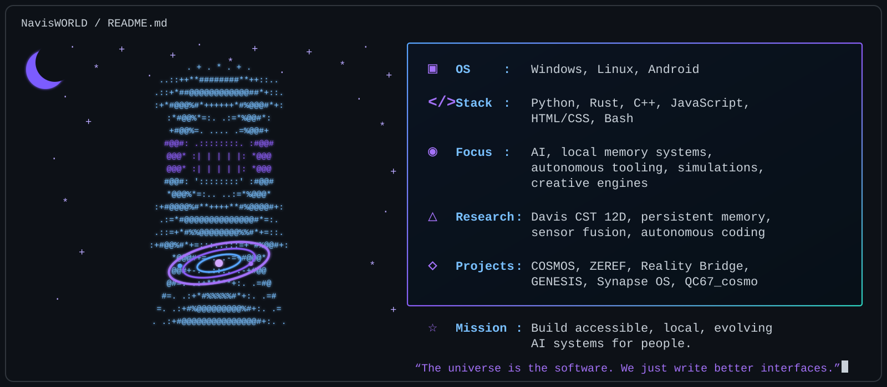

<div align="center">



# CORY DAVIS // NAVISWORLD
### COSMOS • ZEREF • DAVIS CST • SYNAPSE OS • REALITY BRIDGE

**Local AI • Persistent Memory • Dynamic State • Agents • Simulation • Robotics • Creative Computing • Reproducible Research**

[](https://github.com/NavisWORLD)
[](https://github.com/NavisWORLD/Cory-Davis-portfolio-)
[](https://huggingface.co/phera-ra/QC67_cosmo)
[](https://doi.org/10.5281/zenodo.17574447)

</div>

---

## ⚡ SYSTEM STATUS // WHAT I HAVE BUILT

| Domain | Build / achievement | State |
|---|---|---|
| **Local AI Runtime** | Portable local model serving, Ollama/GGUF workflows, web/API/CLI surfaces, health checks and recovery paths | ✅ Implemented |
| **Persistent Memory** | Save/load restoration, semantic memory, episodic memory, graph memory, bounded pattern memory and long-lived state | ✅ Implemented / source-linked |
| **Davis CST / 12D** | Compact evolving state, recurrence, nonlinear controls, state affinity, learned gating and state-aware attention experiments | 🧪 Research + measured experiments |
| **dyn12 / dyn42 / dyn54** | Multi-level dynamic-state ladder with diagnostic and comparative evaluation tooling | 🧪 Experimental |
| **Hebbian / Plasticity** | Hebbian-style and plasticity-oriented state/memory experiments across multiple model and controller layers | 🧪 Experimental |
| **COSMOS** | Local-first cognitive/runtime workspace joining model serving, persistent memory, state, tools, sensory summaries, evaluation and provenance | ✅ Integrated system / active |
| **ZEREF** | Persistent reasoning/coding-agent research lane with tools, memory, self-repair observations, permissions, logging and containment experiments | 🧪 Experimental |
| **Autonomous Agents** | Knowledge-gap discovery, hypothesis → action → data → knowledge loops, coding agents and bounded autonomy | ✅ Implemented / experimental |
| **Synapse OS / Flow** | `.syn` state-oriented language/runtime with procedures, modules, assertions, safe expression evaluation and deterministic execution limits | ✅ 2026 engineering |
| **Reality Bridge** | Universal probe/simulation interfaces, world-state experimentation and realtime creative computing surfaces | ✅ Implemented / experimental |
| **Realtime Audio** | Web Audio instruments, signal analysis, adaptive accompaniment, looping, recording and AI conductor/band systems | ✅ Playable builds |
| **Simulation / World State** | Persistent entity/world state, temporal updates, deterministic simulation and universe-style computational environments | ✅ Implemented / experimental |
| **Cross-language Engineering** | Python, Rust, C++17, C ABI/FFI, CMake/Cargo, browser JavaScript and shared JSON contracts | ✅ Implemented |
| **Sensor / CNS Work** | CNS-style routing, browser/audio/sensor summaries and bio-integration research prototypes | 🧪 Prototype / research |
| **Heartbeat-derived Interfaces** | Rhythm/signature extraction for creative and memorial continuity tooling | 🧪 Bounded prototype |
| **Quantum-classical Bridges** | IBM/Azure integration prototypes, entropy/provenance tooling and matched comparison experiments | 🧪 Experimental |
| **Generative Media** | Local image/video/storybook workflows with continuity state, deterministic receipts and resumable branch exploration | ✅ Implemented / experimental |
| **Research Infrastructure** | Baselines, ablations, causal pairing, state/gate diagnostics, experiment ledgers and preserved null results | ✅ Core methodology |
| **Technical Documentation** | Rebuild manuals, universe manuals, teacher guides, troubleshooting trees, provenance ledgers and architecture docs | ✅ Extensive corpus |

---

# 🧠 COSMOS

**COSMOS is my local-first AI operating/runtime environment.** It is designed around the idea that the useful layer around a model can survive changes in the underlying model itself.

```text
                    ┌───────────────────────┐
                    │  INTERCHANGEABLE LLM  │
                    │ Ollama / GGUF / other │
                    └───────────┬───────────┘
                                │
       ┌────────────────────────┼────────────────────────┐
       ▼                        ▼                        ▼
  PERSISTENT                DYNAMIC                  TOOLS /
    MEMORY                    STATE                   AGENTS
       │                        │                        │
       └────────────────────────┼────────────────────────┘
                                ▼
                           COSMOS LAYER
                                │
       ┌────────────────────────┼────────────────────────┐
       ▼                        ▼                        ▼
  SENSORY / CNS           EVALUATION             PROVENANCE /
   INTERFACES               + TESTS                 RECOVERY
```

### COSMOS capabilities and engineering lanes
- local model runtime and routing
- persistent state across executions
- semantic, episodic and graph memory experiments
- dyn12 / dyn42 / dyn54 internal-state research
- PHOS and controller experiments
- internal monologue / feedback-loop research
- autonomous coding / tool agents
- browser, API and CLI interfaces
- audio and sensor-summary interfaces
- portable runtime packaging
- health checks, fallback routes and recovery tooling
- causal probes, ablations and experiment evidence ledgers

> Persistence, autonomy, self-description or sensor state are engineering properties. They are not presented here as proof of consciousness.

---

# ⚔️ ZEREF

ZEREF is the **agent/autonomy research lane** of the ecosystem: a persistent reasoning and coding system used to study how memory, state, tools, recovery and constraints change agent behavior.

### ZEREF research surfaces
- persistent agent state
- memory-conditioned behavior
- code-writing and tool-use workflows
- controlled self-repair observations
- checkpointing and restart continuity
- bounded autonomy
- permissions and containment boundaries
- paired runs and behavioral comparisons
- tool-selection / exploration measurements
- run logs and evidence preservation

The safety model keeps credential extraction, production-system access, security-control tampering, evidence destruction and uncontrolled persistence outside the experiment off-limits.

---

# 🧬 DAVIS COSMIC SYNAPSE THEORY // CST

CST is my dynamic-state research framework. The software lineage explores whether a compact evolving state can influence model behavior in a measurable and falsifiable way.

**Core research ideas**
- 12D compact state representation
- dyn12 / dyn42 / dyn54 extensions
- recurrence and state carryover
- state affinity
- nonlinear control signals
- learned and hand-designed gating
- bounded memory
- Hebbian/plasticity-inspired updates
- state-aware attention experiments
- causal disablement / ablation testing

Public anchors:
- [The Theory of CST](https://github.com/NavisWORLD/The-theory-of-CST)
- [The Cosmic Davis 12D Hebbian Transformer](https://github.com/NavisWORLD/The-Cosmic-Davis-12D-Hebbian-Transformer-)
- [12D Hebbian Transformer v4.20](https://github.com/NavisWORLD/The-Cosmic-Davis-12D-Hebbian-Transformer-ver.4.20)
- [Zenodo deposited record](https://doi.org/10.5281/zenodo.17574447)

---

# 🖥️ SYNAPSE OS // SYNAPSE FLOW

[Synapse OS](https://github.com/NavisWORLD/Synapse-os-) is the language/runtime and OS-facing engineering branch of the project family.

### Synapse Flow
A bounded `.syn` language/runtime with:
- state and expressions
- control flow
- procedures
- modules
- assertions
- allowlisted / safe expression evaluation
- deterministic execution limits
- OS-facing runtime operations
- tests and documentation

This is a **2026 engineering achievement** and is kept separate from earlier 2025 source chronology.

---

# 🌉 REALITY BRIDGE

Reality Bridge is the umbrella for **simulation, sensing, creative interfaces and computational world/probe systems**.

Public source:
- [Reality Bridge Universal Probe Engine Sim](https://github.com/NavisWORLD/Reality-bridge-universal-probe-engine-sim-)

### What the Reality Bridge branch includes
- persistent scene/entity state
- seeded and deterministic simulation
- universal probe concepts
- realtime visualization
- browser-native interfaces
- audio-reactive systems
- local AI integration
- sensor/bio summary routing
- CAD/device/schematic exploration in adjacent project work

---

# 🎵 ALIEN CONDUCTOR // ADAPTIVE AUDIO

The music branch applies the same state-and-memory thinking to realtime sound.

### Built / researched
- Web Audio instruments
- live input analysis
- pitch/key/chord/tempo inference experiments
- shared musical state
- confidence tracking
- look-ahead scheduling
- generated accompaniment
- looping and recording
- musician / conductor role separation
- local AI band concepts

Public source:
- [Infinite Adaptive Audio 12D Universe Engine](https://github.com/NavisWORLD/infinite-adaptive-audio-12d-universe-engine)

---

# 🌌 SIMULATION / LIVING UNIVERSE WORK

I have built and reconstructed simulation systems that retain world state and evolve it through time instead of treating each run as a disconnected frame.

Public source:
- [Cosmic Synapse Living Universe Sim Engine](https://github.com/NavisWORLD/Cosmic-synapse-the-living-universe-sim-engine-)

Research/build themes:
- evolving persistent worlds
- entity state
- temporal updates
- procedural generation
- sensor/world bridges
- deterministic receipts
- realtime render surfaces
- state communication between systems

---

# 📼 GENERATIVE MEDIA SYSTEMS

Public source:
- [Cosmic Quantum Video Picture Generator](https://github.com/NavisWORLD/Cosmic-quantum-video-picture-generator-)

Build themes:
- local-first generation workflows
- continuity state for characters/scenes
- resumable long-form work
- deterministic receipts
- candidate/branch exploration
- HTTP/JSONL integration
- Rust/C++ surfaces
- installable browser/PWA interfaces

`Multiverse` terminology in this branch refers to **computational candidate branches**, not evidence of physical multiverse access.

---

# 🧠 MEMORY + CNS + RECONCILIATION

Reusable memory/state surfaces include:

- rolling and bounded memory
- save/load restoration
- persistent JSON state
- semantic memory
- episodic retrieval
- graph memory
- vector/object/graph multi-store designs
- knowledge-gap discovery
- long-running checkpointing
- state reconciliation after restarts
- CNS-style signal routing between model, memory, tools and inputs

Public sources:
- [Cosmic Reconciliation Manual](https://github.com/NavisWORLD/Cosmic-reconciliation-manual-)
- [CNS Central Nervous System Adaptive Connector](https://github.com/NavisWORLD/CNS-central-nervous-system-adaptive-connector-)

---

# 🤖 AUTONOMY LINEAGE

```text
input / perception
       │
       ▼
 persistent memory ─────► dynamic state
       │                     │
       └──────────┬──────────┘
                  ▼
          knowledge gap
                  │
                  ▼
             hypothesis
                  │
                  ▼
               action
                  │
                  ▼
                data
                  │
                  ▼
             knowledge
                  │
                  └────────► memory / next state
```

This lineage includes autonomous study, research-loop prototypes, coding agents, tool use, memory-conditioned behavior, recovery and restart continuity.

---

# 🛠️ THE BEAST BOX

[The Beast Box](https://github.com/NavisWORLD/The-beast-box-) is the portable deployment / compute-hub branch of the ecosystem.

It packages the ideas behind local model execution, model assets, runtimes, tools, portability and hardware-facing integration into a system that can move between machines and constrained devices.

---

# 📚 MANUALS + TEACHING

I document systems so someone else can reproduce, inspect, reject or rebuild them.

Public manuals and navigation:
- [Volume I: The COSMOS CST Universe Manual](https://github.com/NavisWORLD/Volume-I-The-COSMOS-CST-Universe-Manual.)
- [Cosmic Reconciliation Manual](https://github.com/NavisWORLD/Cosmic-reconciliation-manual-)
- [Cory Davis Portfolio OS](https://github.com/NavisWORLD/Cory-Davis-portfolio-)

Documentation work includes:
- system architecture maps
- teacher/student guides
- rebuild procedures
- troubleshooting trees
- benchmark notes
- provenance/claim matrices
- installation and recovery documentation
- hardware/software integration notes
- cross-language examples
- experiment receipts and failure logs

---

# 🔬 PROOF MODEL // NO FAKE WINS

```text
SHA-256          -> exact artifact identity
Git history      -> version / authorship / mechanism chronology
DOI              -> deposited citable record
runtime log      -> mechanism executed under captured conditions
controlled test  -> declared metric under captured code/data/seeds
ablation         -> mechanism isolated or disabled
replication      -> reproduced result in the declared scope
NULL             -> declared success criterion was not supported
```

### Evidence vocabulary
- **IMPLEMENTED** — inspectable code/artifact exists
- **OBSERVED** — captured runtime evidence shows execution/state
- **MEASURED** — a declared benchmark produced a metric
- **NULL** — the declared success condition was not supported
- **HYPOTHESIS** — falsifiable proposition awaiting evidence
- **METAPHOR / MODEL** — conceptual or design language, not literal physics/biology without separate evidence

### Nulls intentionally preserved
- A documented paired measured-state benchmark did **not** beat plain attention under its declared success criterion.
- Matched quantum-randomness comparisons do **not** establish a general ML-accuracy advantage.
- Higher-dimensional state variants did **not** monotonically outperform compact dyn12 in the documented ladder.

**The goal is not to protect a theory. The goal is to make the mechanism inspectable enough to survive being wrong.**

---

# 🕰️ SOURCE-LINKED TIMELINE

| Time | Milestone |
|---|---|
| **Jan 2025** | Adaptive retained-memory and persistent accumulation lineage |
| **Feb 2025** | Bounded model memory with save/load restoration across executions |
| **May 2025** | Evolving persistent environment/world state with sensory bridge and timestamped logging |
| **Oct 2025** | Knowledge-gap discovery plus hypothesis → action → data → knowledge autonomous loop |
| **Nov 2025** | Online learning, bounded pattern memory, episodic retrieval and autonomous study/checkpointing |
| **2026** | COSMOS consolidation, dyn12/dyn42/dyn54 research, cross-language libraries, provenance/evaluation tooling, portable runtimes and agent experiments |
| **Aug 2026** | Synapse Flow / Synapse OS, expanded manuals, Reality Bridge systems, portable local AI kits and COSMOS/ZEREF release work |

Full source maps:
- [TECHNICAL_LINEAGE.md](https://github.com/NavisWORLD/Cory-Davis-portfolio-/blob/main/TECHNICAL_LINEAGE.md)
- [TIMELINE.md](https://github.com/NavisWORLD/Cory-Davis-portfolio-/blob/main/TIMELINE.md)
- [PROOF_LEDGER.md](https://github.com/NavisWORLD/Cory-Davis-portfolio-/blob/main/PROOF_LEDGER.md)
- [PROVENANCE.md](https://github.com/NavisWORLD/Cory-Davis-portfolio-/blob/main/PROVENANCE.md)

---

# 🧰 TECH STACK

<div align="center">


</div>

`local inference` • `persistent memory` • `state machines` • `agent orchestration` • `REST APIs` • `CLI tools` • `PWA/browser apps` • `FFI/C ABI` • `CMake/Cargo` • `simulation` • `telemetry` • `sensor-fusion prototypes` • `evaluation harnesses` • `reproducibility`

---

# 🌐 SELECTED PUBLIC REPOSITORY UNIVERSE

### AI / state / foundations
- [CosmicSynapse](https://github.com/NavisWORLD/CosmicSynapse)
- [The Theory of CST](https://github.com/NavisWORLD/The-theory-of-CST)
- [Cosmic Synapse A-LMI](https://github.com/NavisWORLD/cosmic-synapse-A-lmi)
- [The Cosmic Davis 12D Hebbian Transformer](https://github.com/NavisWORLD/The-Cosmic-Davis-12D-Hebbian-Transformer-)
- [12D Hebbian Transformer v4.20](https://github.com/NavisWORLD/The-Cosmic-Davis-12D-Hebbian-Transformer-ver.4.20)
- [Hermes Agent](https://github.com/NavisWORLD/hermes-agent)
- [The Beast Box](https://github.com/NavisWORLD/The-beast-box-)
- [Synapse OS](https://github.com/NavisWORLD/Synapse-os-)
- [Cosmic Nova OS / GGUF surface](https://github.com/NavisWORLD/Cosmic-nova-os-GGUF-model-and-system-)

### Simulation / creative / interfaces
- [Reality Bridge Universal Probe Engine](https://github.com/NavisWORLD/Reality-bridge-universal-probe-engine-sim-)
- [Living Universe Sim Engine](https://github.com/NavisWORLD/Cosmic-synapse-the-living-universe-sim-engine-)
- [Infinite Adaptive Audio 12D Universe Engine](https://github.com/NavisWORLD/infinite-adaptive-audio-12d-universe-engine)
- [Cosmic Quantum Video Picture Generator](https://github.com/NavisWORLD/Cosmic-quantum-video-picture-generator-)

### Manuals / reusable infrastructure
- [COSMOS CST Universe Manual](https://github.com/NavisWORLD/Volume-I-The-COSMOS-CST-Universe-Manual.)
- [Cosmic Reconciliation Manual](https://github.com/NavisWORLD/Cosmic-reconciliation-manual-)
- [CNS Adaptive Connector](https://github.com/NavisWORLD/CNS-central-nervous-system-adaptive-connector-)
- [Cory Davis Portfolio](https://github.com/NavisWORLD/Cory-Davis-portfolio-)

### Safety / community research concept
- [Flock Camera Bio Update](https://github.com/NavisWORLD/Flock-camera-bio-update-) — research concept with privacy, consent and lawful-use constraints kept explicit.

### Active private / protected project surfaces
The connected account also contains protected work including **Cosmos**, **Arxiv-12dyn**, **Python CST Libraries**, **COSMOS HEARTLIGHT**, **Synaptic Systems**, **Quantum/Azure/IBM bridge work**, **bio-integration tooling**, **research logs**, and additional Reality Bridge / memorial-continuity / model-system development repositories. These are intentionally not exposed here as public source links.

---

# 🧪 RESEARCH + PUBLICATION SURFACES

| Surface | Purpose |
|---|---|
| **GitHub** | code, history, commits, tests, releases and documentation |
| **Hugging Face** | QC67_cosmo / portable local-model distribution work |
| **Zenodo** | deposited research record and DOI |
| **Portfolio OS** | corrected chronology, attribution, proof ledger and technical navigation |

**Hugging Face:** https://huggingface.co/phera-ra/QC67_cosmo  
**Zenodo DOI:** https://doi.org/10.5281/zenodo.17574447  
**Portfolio:** https://github.com/NavisWORLD/Cory-Davis-portfolio-

---

# 🧭 MISSION

```text
               USER OWNS THE MACHINE
                        │
                        ▼
          LOCAL / INTERCHANGEABLE MODEL
                        │
             ┌──────────┼──────────┐
             ▼          ▼          ▼
           MEMORY      STATE      TOOLS
             │          │          │
             └──────────┼──────────┘
                        ▼
                   COSMOS LAYER
                        │
        ┌───────────────┼───────────────┐
        ▼               ▼               ▼
      ZEREF        REALITY BRIDGE    ROBOTICS
        │               │               │
        └───────────────┼───────────────┘
                        ▼
              EVIDENCE + PROVENANCE
                        │
                        ▼
                 INSPECT / LEARN / GROW
```

I am building toward AI systems that are:

- **local** enough to belong to the user
- **persistent** enough to remember real context over time
- **portable** enough to survive hardware and model changes
- **inspectable** enough to audit what happened
- **recoverable** enough to fail without erasing history
- **creative** enough to work across software, music, simulation and robotics
- **measurable** enough to separate a compelling story from a real result

---

<div align="center">

## © 2026 Cory Davis // NavisWORLD
### COSMOS • ZEREF • DAVIS CST • SYNAPSE OS • REALITY BRIDGE

**Build strange. Measure hard. Leave a map.**

*The universe is the software. We just write better interfaces.*

</div>
